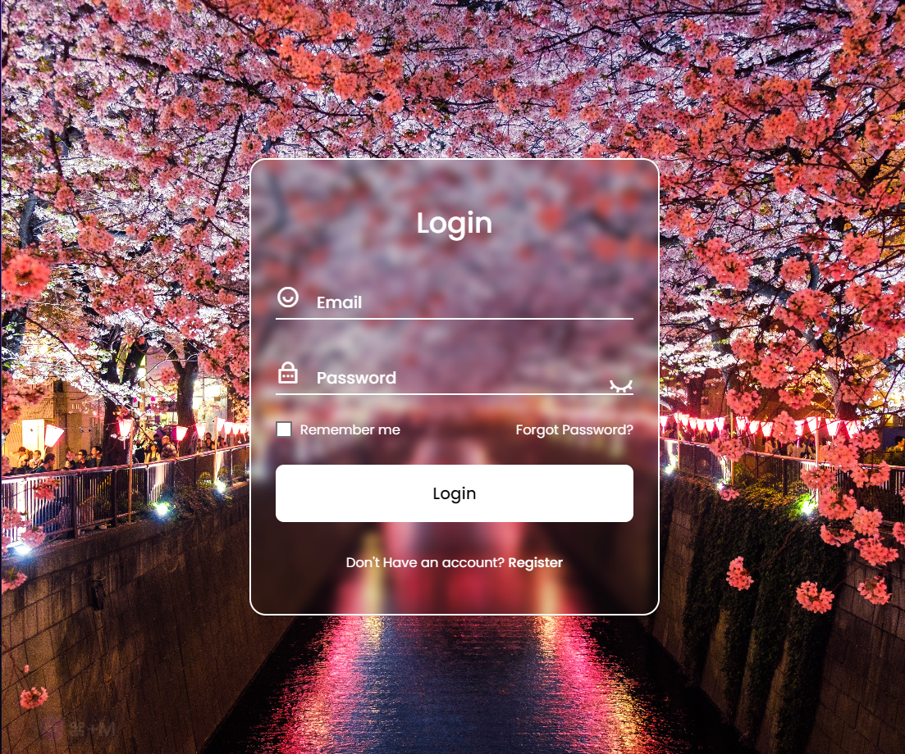

## Login Form 

This is a login form built using HTML, CSS, and JavaScript. It incorporates the following features:

- **Floating Labels**: The form fields have floating labels that move up when the user starts typing in the respective field, providing a better user experience and visual clarity.

- **Icon Toggle**: The form includes an icon toggle feature that allows the user to show or hide the password. By clicking the icon, the password field will display or mask the entered characters, giving the user control over their password visibility.

- **Remember Me Box**: The form has a "Remember Me" checkbox that allows the user to choose whether they want their login credentials to be remembered for future logins. This feature is useful for convenience and ease of use.

- **Forgot Password Option**: The form provides a "Forgot Password" link that users can click on in case they have forgotten their password. Clicking the link will direct them to the password recovery process or the appropriate page to reset their password.


## Preview




**Instructions**:

1. Clone the project to your local directory
    
    ```git clone https://github.com/dot-D69/LOGIN-FORM.git ```

2. Open the project in your preferred code editor

3. Run the index.html file in your browser

4. Enjoy! :smile:

